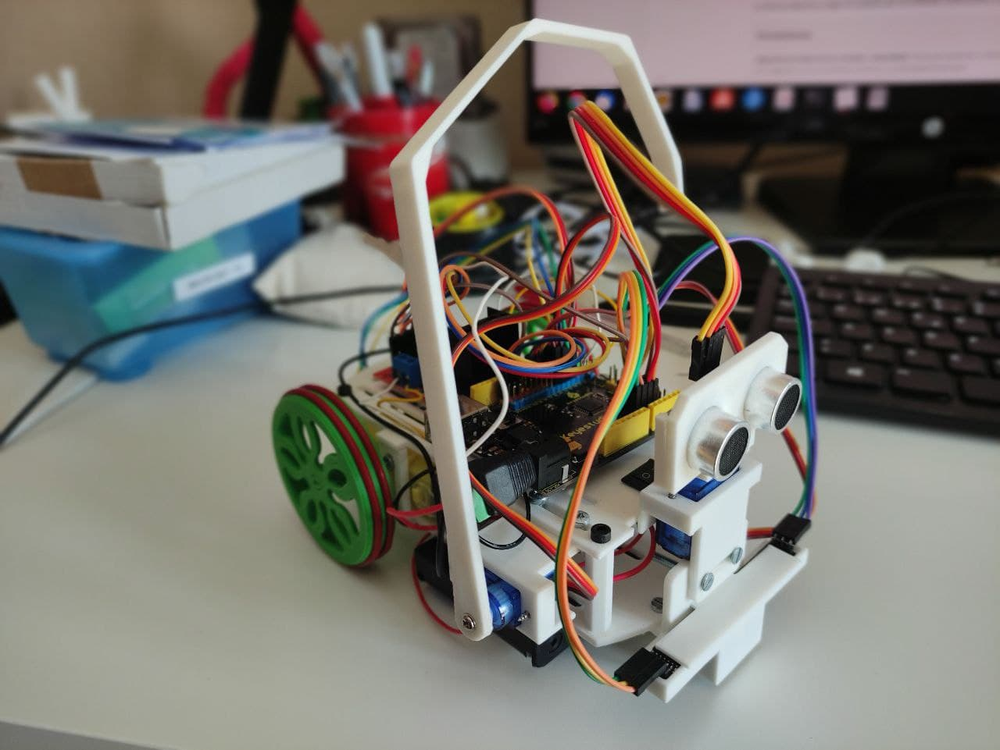
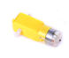
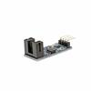
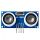
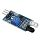
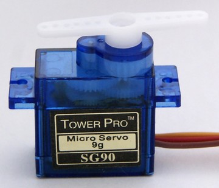
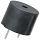

# Autoría
* *Antonio Gomez*

# Aportaciones
* *Maribel Ruiz Martínez*
* *Pedro Ruiz Fernández*

# Control de Versiones
* 0.1 (25/05/2021): versión derivada de librería masaylo de *Antonio Gómez*, incorpora como novedades: integración de trabajo con encoders, simplificación en procedimientos para mover el robot, control de PWM de motores con pines ENA y ENB del driver de motores, incorporación de la posibilidad de trabajar con sensores infrarrojos con detección de negro 1 o detección de negro a 0, control de servomotores y buzzer.

# Librería de arduino para Masaylo
Repositorio para albergar librería para programar de forma amigable Masaylo.

## Antecedentes
Unos de los problemas para controlar robots muchas veces es la ausencia de instrucciones amigables en arduino para controlar sus elementos (motores dc, sensor de ultrasonidos, sensores infrarrojos para seguir líneas, control de distancias y giros a través de encoders, servomotores y zumbadores), todo ello pensando en el acercamiento del uso de dicho robot para estudiantes de secundaria. Por este motivo desde el Club de Robótica de Granada nos planteamos adaptar la librería de Antonio Gómez de su robot Masaylo para el control de una revisión de dicho robot.
## Librería
La librería debemos cargar en arduino por los métodos tradicionales, incluyendo el zip o copiandola descomprimida en la carpeta "libraries" de arduino.
|Procedimientos | Elemento a controlar|
|:--|---|
| **objetoMasaylo.init (pinPWMMotorIzdo,pinAMotorIzdo, pinBMotorIzdo, pinPWMMotorDcho,pinAMotorDcho, pinBMotorDcho )**: configura los pines de los motores de Masaylo. Si no pasas parámetros objetoMasaylo.init(), pone los valores objetoMasaylo.init(6,7,8,11,12,13). |Motores |
|**objetoMasaylo.adelante (velocidad)**: Mueve el robot Masaylo hacia delante, le podemos pasar  a la velocidad a la que lo hace (entre 0 y 255), si no pasamos valor lo hace a 255.|Motores |
| **objetoMasaylo.atras (velocidad)**: Mueve el robot Masaylo hacia atrás, le podemos pasar  a la velocidad a la que lo hace (entre 0 y 255), si no pasamos valor lo hace a 255. |Motores |
|**objetoMasaylo.izquierda (velocidad)**: Mueve el robot Masaylo hacia la izquierda, le podemos pasar  a la velocidad a la que lo hace (entre 0 y 255), si no pasamos valor lo hace a 255.|Motores |
| **objetoMasaylo.derecha (velocidad)**: Mueve el robot Masaylo hacia la derecha, le podemos pasar  a la velocidad a la que lo hace (entre 0 y 255), si no pasamos valor lo hace a 255. | Motores  |
| **objetoMasaylo.alto ()**: Para el robot Masaylo.            | Motores  |
|**objetoMasaylo.encoders (pinIzdoEncoder, pinDchoEncoder, diametro cm)**: Configura los pines de los sensores infrarrojos de los encoders y el diámetro en cm de las ruedas. Si no pasas parámetros objetoMasaylo.encoders(), pone los valores objetoMasaylo.encoders(2,3,7).| Encoders  |
| **objetoMasaylo.distancia (distancia)**: Nos indica cuando ambas ruedas del robot Masaylo se ha movido la cantidad de cm que le hemos pasado. | Encoders  |
|**objetoMasaylo.angulo (angulo)**: Nos indica cuando ambas ruedas del robot Masaylo ha girado el angulo pasado.| Encoders  |
|**objetoMasaylo.vueltas (n_vueltas)**: Nos indica cuando ambas ruedas del robot Masaylo ha girado el numero de vueltas indicadas.| Encoders  |
|**objetoMasaylo.ultrasonidos (pinTrigger,pinEcho)**: Configura los pines trigger y echo del sensor de ultrasonidos. Si no pasas parámetros objetoMasaylo.ultrasonidos(), pone los valores objetoMasaylo.ultrasonidos(16,17).| Ultrasonidos  |
|**objetoMasaylo.distancia ()**: Nos devuelve la distancia en cm del sensor de ultrasonidos.| Ultrasonidos  |
|**objetoMasaylo.infrarrojos (pinIzdoIr,pinDchoIr)**: Configura los pines de los sensores infrarrojos de suelo del robot. Si no pasas parámetros objetoMasaylo.infrarrojos(), pone los valores objetoMasaylo.infrarrojos(14,15).| Infrarrojos  |
|**objetoMasaylo.nIzquierda ()**: Nos devuelve "true" si el sensor de infrarrojos izquierdo está a negro y "false" si no lo está. Si no se pasa ningún parámetro, el sensor que hemos puesto debe devolver 1 cuando está a negro. Si nuestro sensor devuelve 0 cuando está a negro debemos de pasar el parámetro 0, ejemplo:objetoMasaylo.nIzquierda(0).| Infrarrojos  |
|**objetoMasaylo.nDerecha ()**: Nos devuelve "true" si el sensor de infrarrojos derecho está a negro y "false" si no lo está. Si no se pasa ningún parámetro, el sensor que hemos puesto debe devolver 1 cuando está a negro. Si nuestro sensor devuelve 0 cuando está a negro debemos de pasar el parámetro 0, ejemplo:objetoMasaylo.nIzquierda(0).| Infrarrojos  |
|**objetoMasaylo.bIzquierda ()**: Nos devuelve "true" si el sensor de infrarrojos izquierdo está a blanco y "false" si no lo está. Si no se pasa ningún parámetro, el sensor que hemos puesto debe devolver 1 cuando está a negro. Si nuestro sensor devuelve 0 cuando está a negro debemos de pasar el parámetro 0, ejemplo:objetoMasaylo.bIzquierda(0).| Infrarrojos  |
|**objetoMasaylo.bDerecha ()**: Nos devuelve "true" si el sensor de infrarrojos derecho está a blanco y "false" si no lo está. Si no se pasa ningún parámetro, el sensor que hemos puesto debe devolver 1 cuando está a negro. Si nuestro sensor devuelve 0 cuando está a negro debemos de pasar el parámetro 0, ejemplo:objetoMasaylo.nDerecha(0).| Infrarrojos  |
| **objetoMasaylo.servos (pin servocabeza, pin servobrazo)**: Configura los pines de los servos de la cabeza y del brazo respectivamente. Si no pasas parámetros objetoMasaylo.servos(), pone los valores objetoMasaylo.servos(5,4). | Microservo  |
| **objetoMasaylo.giracabeza (grados)**: Gira el servo de la cabeza un ángulo dado entre 0 y 179 grados. | Microservo  |
| **objetoMasaylo.girabrazo (grados)**: Gira el servo del brazo un ángulo dado entre 0 y 179 grados. | Microservo  |
| **objetoMasaylo.buzzer (pin buzzer)**:  Configura el pin del buzzer. Si no pasas parámetros objetoMasaylo.buzzer(), pone los valores objetoMasaylo.buzzer(18). | Buzzer  |
|**objetoMasaylo.tono (frecuencia, duración)**: emite un sonido en el zumbador configurado anteriormente, de una cierta frecuencia en Hz y duración en ms.| Buzzer  |

### Ejemplo Movimientos Básicos
~~~
#include<Masaylo.h>

Masaylo m;//definimos objeto m de tipo Masaylo

void setup() {
  // Inicializamos los motores de Masaylo:
  m.init(7, 8, 6, 12, 13, 11); //Motor izdo:pines 7,8 para control de giro y 6 control pwm, Motor dcho:pines 12,13 para control de giro y 11 pwm
  //Las funciones de movimiento son: adelante(), atras(), izquierda(), derecha() y alto()
  m.adelante();
  delay(1000);
  m.izquierda();
  delay(1000);
  m.atras();
  delay(1000);
  m.derecha();
  delay(1000);
  m.alto();
}

void loop() {
}
~~~

### Ejemplo ###
~~~

~~~
### Ejemplo
~~~

~~~
### Ejemplo
~~~

~~~